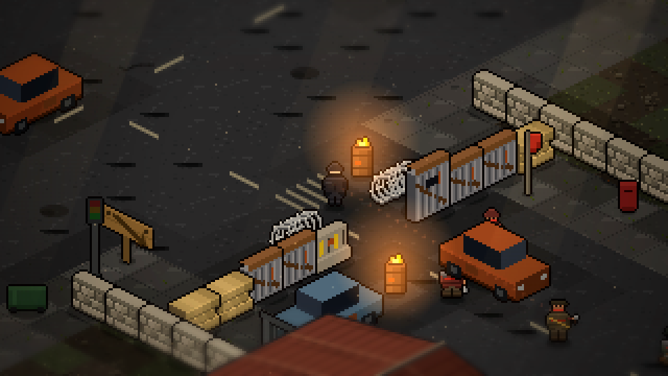

# THE ROADBLOCKS — bandits on the church road

The first **people** you fight. Everything about them is built to say so.

## Where they are, and why there

Two blocks, one on each crossroads that ends the church corridor
(see [city-map.md](city-map.md)):

| block | line | chicane | faces | crossroads |
|---|---|---|---|---|
| **west** | x 38, y 70–80 | y 74–75 | west | spine × east cross, (30, 75) |
| **east** | x 86, y 70–80 | y 76–77 | east | mid street × east cross, (92, 75) |

The siting is the point. The **signed shelter trail** — the planks and bedsheets
somebody nailed up to guide frightened people to Candlelight — walks you west
along the gate road, north up the mid street, then *left at the crossroads*.
That left turn is the **east block**. The bandits set up exactly where somebody
else's arrows funnel the desperate. Back out and take the long way round, down
the spine instead, and it only brings you to the other one.

The chicanes sit at different heights so the two never read as copy-paste.

## What a roadblock is made of

One tile thick, spanning the full street pavement-to-pavement, with a two-tile
gap left in it. **You are meant to get through** — the gap is the door, the four
of them behind it are the lock.

Along the line: sandbags → corrugated sheet-steel panels → a **tall firing
screen** with a slot cut in it → *the chicane* → a concrete barrier → more
panels → sandbags. Flanking the gap on the approach side: **razor coils**, and a
**burning oil drum** either side so the way through is lit and obviously
watched. Behind the line: a wrecked car dragged in to thicken it, and a **red
rag on a scaffold pole** — this block is claimed. A plank nailed up facing the
way you come in:

> TOLL. LEAVE WHAT YOU CARRY *(west)*
> THIS ROAD IS OURS. PAY OR TURN BACK *(east)*

**THE ANGLE RULE**: the barricade runs along world **+y**, so every piece takes
its `y` variant. All of it — panels, sandbags, concrete, coils, the yard wall —
is built in face space from its own footprint, the same construction the cars
and the buildings use. Nothing is a sheared rectangle. Only the braziers and the
flag are drawn straight, because they are free-standing and upright.

## The four

The machines in the yard hunt you as individuals: each Scrapper notices you on
its own and comes on its own. These do not. **One of them sees you and shouts,
and the whole block turns at once.** That single line is the difference between
a patrol and a gang, and it is what makes a checkpoint feel like a checkpoint.

| role | HP | sight | damage | reach / band | notes |
|---|---|---|---|---|---|
| **knifer** ×2 | 34 | 7.0 | 10 | 1.15 | fast, fragile, no reach; 0.38 s windup |
| **pistoleer** | 30 | 8.5 | 7 | 2.6–7.5, holds 4.8 | 1.35 s cycle, sidesteps while reloading |
| **rifleman** | 26 | 11.5 | 16 | 3.2–15.0, holds 9.0 | 1.05 s aim, 2.7 s cycle, hits hardest |

Two of them wear a knife, one a scrap pistol, one a rifle. Kill order is the
skill: rush the rifle and the knives are on you, hold back and the rifle picks
you apart.

Every one of them wears the same **dirty red rag** — face wrap, headband,
neckerchief, scarf — so you know at a glance who they belong to. Nothing they
wear glows. The machines' language is amber; these are people, so a hit on one
is a dull thud and a stagger, not a shower of sparks.

## Reading the fight

- **Cover is real.** The barricade blocks line of sight both ways. Stand behind
  the panels off the gap line and not one of the four can touch you — verified:
  0 damage over 12 seconds with the whole block awake. The gap is the *only*
  place any of them can see you from, which makes it the fight.
- **The rifle tells you.** A dashed line from the barrel to you, brightening
  over a full second, plus the same red blink overhead the Scrapper uses before
  it swings. Break the line — step behind a panel, put the wreck between you —
  and the shot is thrown away. That is the whole counterplay.
- **Knifers and the pistoleer will come through the chicane after you.** The
  rifleman holds the line and does not follow.
- Fuel pumps, barrels and the gas station work on them exactly as on anything
  else. A pump beside a checkpoint is a legitimate way to take one.

## Tuning

Against a player standing in the gap doing nothing, four of them took a passive
100 HP down in about **six** seconds. That is a wall, not a fight. Softened to
roughly **nine**, which is long enough that someone carrying only the pipe can
back out through the chicane and take them a piece at a time, and still short
enough that standing in the open is a death sentence.

Measured with a bot that fights back but never dodges, never shoots and never
breaks line of sight:

| loadout | position | result |
|---|---|---|
| piercing knife | holding the chicane | 3 of 4 down, died at 22 s to the rifle |
| metal pipe | holding the chicane | 2 of 4 down, died at 14 s |
| metal pipe | standing in the open | 2 of 4 down, survived 89 s |

A real player has far more agency than that bot, so this is a demanding fight
rather than an unfair one. Worth a proper playtest.

## Persistence

**A raider you killed stays killed.** Respawning them would turn a roadblock
into a wall you can never get past, and dying halfway through would cost you the
whole fight. The dead are per-area world state, keyed by *which block and which
post* they held (`west:0`, `east:2`, with a trailing `!` once searched) rather
than by array index, so map edits can never shuffle them. A save written before
the roadblocks existed simply has no list and every post is manned.

Clearing all four latches `roadblock.cleared` and prints **THE ROAD IS CLEAR**.

## Loot

Searching a body gives 1–3 scrap, a 30% chance of a snack bar, and rounds from
the two shooters (2–5 from the pistoleer, 4–7 from the rifleman).

## Open — not decided here

**The rifle is not a pickup.** `PROJECT_STATE.md` lists "enemies dropping their
rifles as the ring's weapon upgrade" as a question that was never answered, and
this pass deliberately does not answer it. The rifleman drops rounds, not the
weapon. If the rifle should become the Fringe's gear reward, that is a
progression decision to make on purpose.
