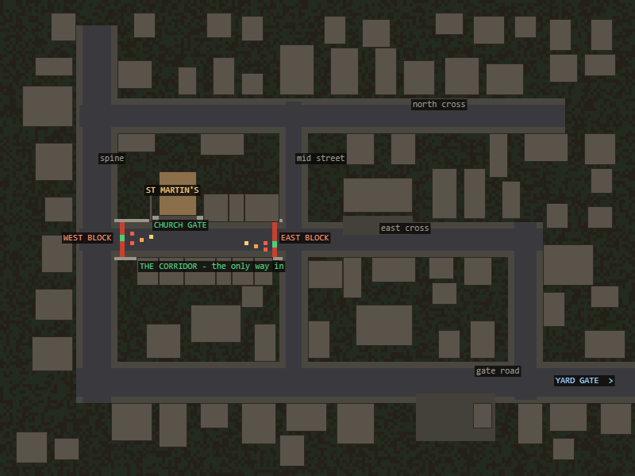

# THE FRINGE — the exact map

The city is one continuous 200 × 150 area, no loading. Everything below is
authored in `buildFringe()` in `js/map.js`; nothing here is procedural except
the building fill between the streets and the ground litter.



## Ground types
| id | what |
|---|---|
| 2 | rubble (under buildings) |
| 4 | carriageway |
| 5 | pavement |
| 6 | verge / dead lot |
| 7 | forecourt (gas station, playground, church paving) |

## The street network

Six hand-drawn segments. `half` is the number of lane tiles either side of the
centre line; the pavement is a further 2 tiles beyond that.

| street | from | to | half | road tiles | pavement |
|---|---|---|---|---|---|
| gate road | (30, 120) | (196, 120) | 4 | y 116–124 | y 114–115, 125–126 |
| spine | (30, 14) | (30, 120) | 4 | x 26–34 | x 24–25, 35–36 |
| north cross | (30, 36) | (172, 36) | 3 | y 33–39 | y 31–32, 40–41 |
| east cross | (30, 75) | (165, 75) | 3 | y 72–78 | y 70–71, 79–80 |
| south link | (165, 75) | (165, 120) | 3 | x 162–168 | x 160–161, 169–170 |
| mid street | (92, 36) | (92, 120) | 2 | x 90–94 | x 88–89, 95–96 |

Junctions: (30,120) (92,120) (165,120) · (30,75) (92,75) (165,75) ·
(30,36) (92,36) (172,36).

## Landmarks

| what | footprint (x, y, w, h) | kind |
|---|---|---|
| St Martin's church | 50, 54, 12, 14 | R |
| Aldergrove Primary | 108, 56, 22, 11 | K |
| The Regent Hotel | 112, 96, 18, 13 | T |
| City & County Bank | 60, 96, 16, 12 | N |
| Gas station forecourt | 132, 125, 24, 14 | canopy + 4 pumps + shop |

The player enters from the junkyard at **(194, 120)**, the east end of the gate
road. The yard gate is in the map's east wall at y 118–122.

## THE CHURCH CORRIDOR — why the city needed changing

The Fringe was drawn as streets laid over open lots. The blocks between the
streets were never closed, so you could walk to St Martin's across waste ground
and never touch a road at all. That was measured before anything was built:
cutting the east cross at **both** junctions still left the church reachable by
**46 of its 46** forecourt tiles. Two roadblocks on two crossroads would have
gated nothing.

So the fix is not a fence, it is **city**. The east cross between the spine and
the mid street is now a proper street — continuous building frontage on both
sides, the way a real one has:

- **north frontage** — the lot row at **y 69**, from x 36 to x 88
- **south frontage** — the lot row at **y 81**, from x 36 to x 88
- buildings where one fits (a terrace 2–9 tiles deep), a **stone yard wall**
  where it does not, which is what a real terrace does where it runs out of
  house

with exactly **one** opening in it:

- **the church gate** — x 50–61 at y 69, the full width of the church, flanked
  by **stone piers** on x 48–49 and x 62–63 at y 68–69

The forecourt (x 50–61, y 68–69) is therefore bounded by the church itself to
the north, a pier either side, and the street to the south. The only way into
it is along the corridor.

The corridor has two ends, and both ends are crossroads. See
[bandits.md](bandits.md) for what is standing in them.

```
          spine (x30)                          mid street (x92)
              |                                       |
    ==========+=====[ WEST BLOCK x38 ]===...===[ EAST BLOCK x86 ]=====+=======
              |              ^                                        |
           (30,75)           |   church gate, x50-61                (92,75)
                          ST MARTIN'S
```

## Verification

Flood fill from the player's entry point at (194, 120), using the same
collision test the player's own movement uses:

| both chicanes | forecourt tiles reachable |
|---|---|
| open | 24 / 24 |
| west only open | 24 / 24 |
| east only open | 24 / 24 |
| both sealed | **0 / 24** |

So every route to the church passes through one of the two roadblocks, and
either one alone is enough. Sealing both removes 509 tiles from the reachable
city — the corridor and the forecourt, and nothing else. No other part of the
map is cut off.

Re-run it any time by pasting the flood fill in `buildFringe`'s verification
note into the console after `buildFringe()`.

## Frame cost

353 props in the area. 2.8 ms/frame standing at a roadblock, 4.3 ms in the open
street, 3.1 ms in the junkyard. The cordon and the two blocks cost nothing
measurable — the corridor is the *cheapest* place in the city to stand, because
the frontage occludes most of the block behind it.
